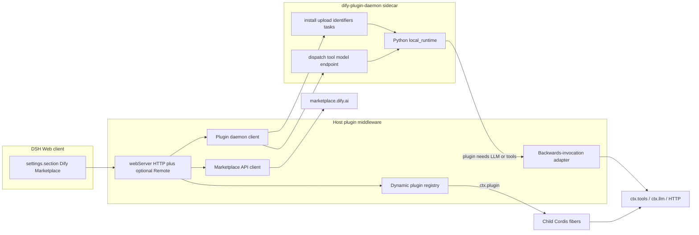

# Architecture

## Ownership

| Face | Owns | Must not own |
|---|---|---|
| Host (`src/host`, `src/index.ts`) | Marketplace HTTP, daemon lifecycle, credential vault, install state, `ctx.plugin` children, `ctx.tools` / `ctx.llm` adapters | Presentation, optimistic "installed" |
| Client (`src/client`) | Settings section UI, locale dictionaries, pending/failed/disconnected rendering | Secrets, durable install records, marketplace downloads |
| Runtime child (`src/runtime`) | One installed Dify plugin's DSH surface | Marketplace browsing |
| Sidecar | Python plugin processes, install tasks, dispatch | DSH slots |

## Data stores

All durable Host state lives under `$DSH_HOME/storages/dify-marketplace/`:

| Path | Contents |
|---|---|
| `installed.json` | Installed plugin records (unique identifier, category, fiber id, snapshot) |
| `credentials/` | Secret vault. Host-only. Never copied into the client bundle |

Profile composition stays in `$DSH_HOME/profiles/<name>/` (`dsh.profile.bundles`). This plugin's row id is `dsh-dify-marketplace`.

## Data flow

```text
Settings section (client)
  -> Host HTTP or Remote
    -> Marketplace API client -> marketplace.dify.ai
    -> Plugin daemon client -> dify-plugin-daemon
    -> Dynamic registry -> ctx.plugin(runtimeChild, config)
      -> ctx.tools / ctx.llm / webServer routes
```

Install path (Dify `PluginInstaller`, reproduced not mocked):

```text
search/detail -> latest_package_identifier
  -> GET /api/v1/plugins/download-url (302 to .difypkg)
  -> POST /plugin/:tenant/management/install/upload/package
  -> POST /plugin/:tenant/management/install/identifiers
  -> poll GET /plugin/:tenant/management/install/tasks/:id
  -> configure credentials
  -> POST /plugin/:tenant/dispatch/<capability>
```

## Child fibers

Fiber id: `dify:<org>/<name>`. Package name on the Loader row remains `dsh-dify-marketplace`. Config includes `pluginUniqueIdentifier` and `category`. Unload disposes tools, credential handles, and the daemon installation.

## Host to client bridge

Out-of-tree peers do not use Harness Typert `/remote` codegen:

- dsh-market registers `ctx.webServer` HTTP routes and fetches them from the browser.
- DSH-Plugins-Marketplace does the same (`inject: ['webServer']`).
- Built-in Harness packages use Typert `ctx.remote` plus generated `/remote` modules.
- Dynamic Cordis plugins use `harness.handle` / `host.call` (cordis-host-runner).

This plugin follows the peer webServer loopback pattern unless Phase 2 adopts Typert (see open questions).

## Diagram


